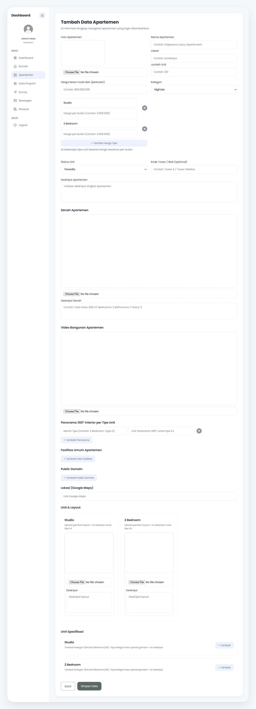
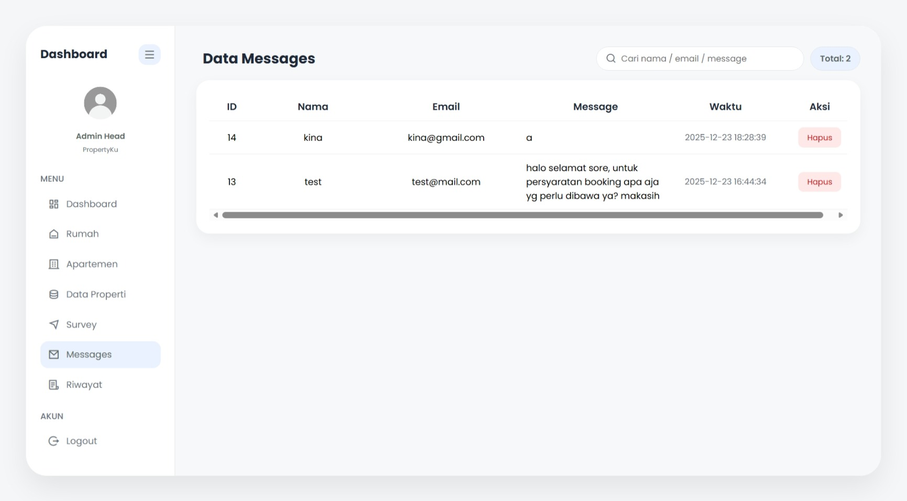
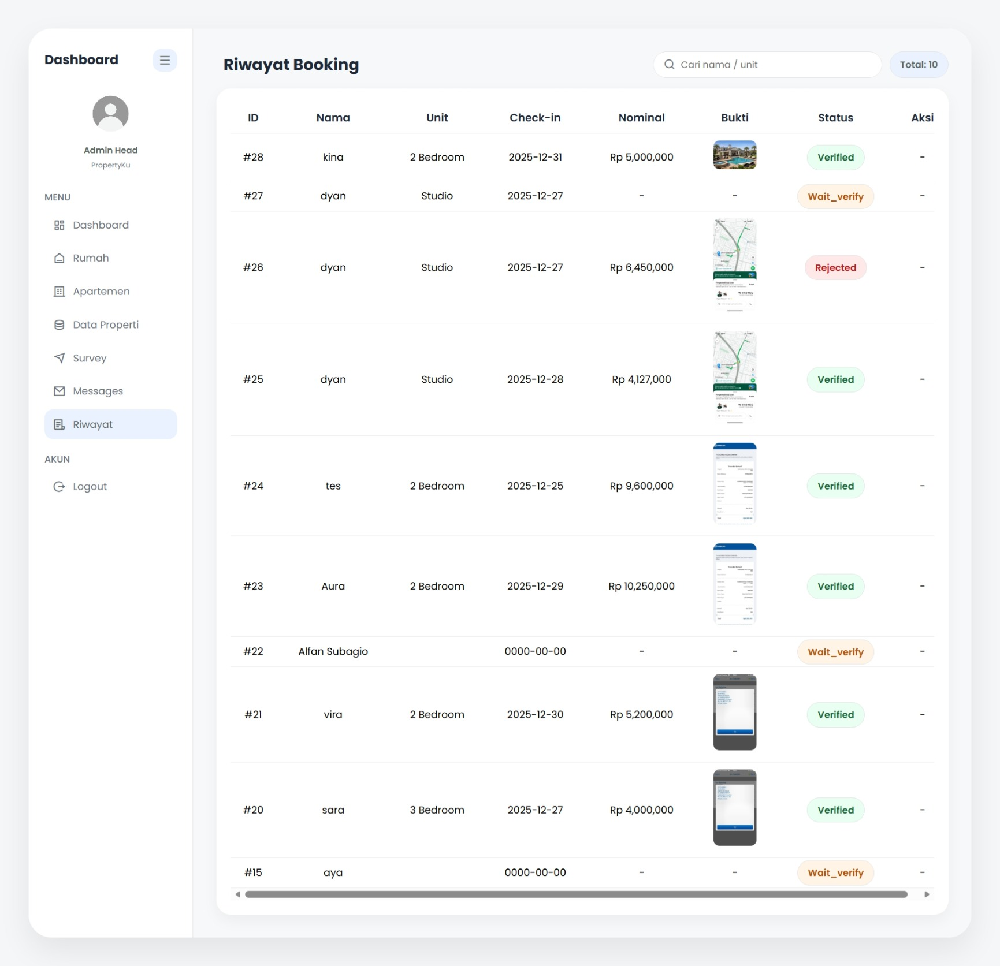

# PropertyKu

PropertyKu adalah sebuah website berbasis web yang dikembangkan sebagai project UAS pada mata kuliah Pemrograman Berbasis Project. Website ini berfungsi sebagai sistem informasi jual dan sewa properti berupa rumah dan apartemen yang dapat diakses secara online.

Project ini dirancang untuk memudahkan pengguna dalam mencari informasi properti, melihat detail properti, serta melakukan booking sewa atau beli secara online tanpa menggunakan sistem pembayaran pihak ketiga.

---

## 🎯 Tujuan Project
- Membangun website jual dan sewa properti berbasis web
- Menerapkan konsep pemrograman berbasis project
- Mengintegrasikan frontend, backend, dan database dalam satu sistem
- Melatih penggunaan teknologi web secara nyata

---

## 👥 Jenis Pengguna
### User
- Registrasi dan login akun
- Melihat daftar dan detail properti
- Melakukan booking sewa atau beli
- Menggunakan fitur pencarian dan filter
- Menyimpan properti favorit
- Melihat riwayat booking
- Mengirim kritik dan saran

### Admin
- Login ke dashboard admin
- Mengelola data properti (tambah, edit, hapus)
- Mengelola gambar dan video properti
- Mengelola data booking user

---

## 🛠️ Teknologi yang Digunakan
- HTML  
- CSS  
- JavaScript  
- PHP  
- MySQL  
- XAMPP (Local Server)

---

## 🚫 Fitur yang Tidak Digunakan
- Payment Gateway (Midtrans)
- Forgot Password
- Chatbot AI
- Generate QR otomatis (QR masih bersifat statis)

Alasan tidak menggunakan fitur tersebut adalah keterbatasan waktu, scope project UAS, serta penggunaan teknologi dasar tanpa framework tambahan.

---

## ▶️ Cara Menjalankan Project (Localhost)
1. Pastikan XAMPP sudah terinstall
2. Jalankan Apache dan MySQL
3. Salin folder project ke direktori `htdocs`
4. Import database melalui phpMyAdmin
5. Akses website melalui browser dengan `localhost`

---

## 📌 Catatan
Project ini dibuat untuk keperluan akademik dan pembelajaran. Seluruh fitur dan implementasi disesuaikan dengan kebutuhan project UAS.

## ⚡ Admin

Berikut adalah tampilan halaman Admin pada website PropertyKu.

### Admin Apartemen

### Admin Dashboard

### Admin Data Properti

### Admin Message

### Admin Riwayat

### Admin Rumah

### Admin Survey

---

## 🧑 User

Keterangan singkat: Bagian ini menampilkan tampilan untuk User.

<!-- Gambar 1 -->

*Login page untuk User*

<!-- Gambar 2 -->

*Dashboard utama User*

<!-- Tambahkan gambar lain user di sini -->
<!-- Contoh:

*Keterangan gambar* -->

---

