# PropertyKu

PropertyKu adalah sebuah website berbasis web yang dikembangkan sebagai project UAS pada mata kuliah Pemrograman Berbasis Platform. Website ini berfungsi sebagai sistem informasi jual dan sewa properti berupa rumah dan apartemen yang dapat diakses secara online.

Project ini dirancang untuk memudahkan pengguna dalam mencari informasi properti, melihat detail properti, serta melakukan booking sewa atau beli secara online tanpa menggunakan sistem pembayaran pihak ketiga.

---

## 🎯 Tujuan Project
- Membangun website jual dan sewa properti berbasis web
- Menerapkan konsep pemrograman berbasis project
- Mengintegrasikan frontend, backend, dan database dalam satu sistem
- Melatih penggunaan teknologi web secara nyata

---

## 👥 Jenis Pengguna
### 👤 User
- Registrasi dan login akun
- Melihat daftar dan detail properti
- Melakukan booking sewa atau beli properti
- Menggunakan fitur pencarian dan filter properti
- Menyimpan properti favorit
- Melihat riwayat booking dan status transaksi
- Mengunggah bukti pembayaran
- Mengecek status verifikasi booking
- Mengunduh invoice booking (PDF) beserta QR Code
- Mengirim pesan untuk survey properti
- Mengirim kritik dan saran

### 👨‍💼 Admin
- Login ke dashboard admin
- Mengelola data properti rumah
- Mengelola data apartemen
- Mengelola data properti (tambah, edit, hapus)
- Melihat dan memproses data booking user
- Memverifikasi bukti pembayaran booking
- Menyetujui atau menolak booking (approve / reject)
- Melihat hasil survei properti dari user
- Melihat pesan kritik dan saran dari user
- Logout dari sistem

---

## 🛠️ Teknologi yang Digunakan
- HTML  
- CSS  
- JavaScript  
- PHP  
- MySQL  
- XAMPP (Local Server)

---

## 🚫 Fitur yang Tidak Digunakan
- Payment Gateway (Midtrans)
- Forgot Password
- Chatbot AI

Alasan tidak menggunakan fitur tersebut adalah keterbatasan waktu, scope project UAS, serta penggunaan teknologi dasar tanpa framework tambahan.

---

## ▶️ Cara Menjalankan Project (Localhost)
1. Pastikan XAMPP sudah terinstall
2. Jalankan Apache dan MySQL
3. Salin folder project ke direktori `htdocs`
4. Import database melalui phpMyAdmin
5. Akses website melalui browser dengan `localhost`

---

## 📌 Catatan
Project ini dibuat untuk keperluan akademik dan pembelajaran. Seluruh fitur dan implementasi disesuaikan dengan kebutuhan project UAS.

## ⚡ Admin

Berikut adalah tampilan halaman Admin pada website PropertyKu.

### Admin Apartemen
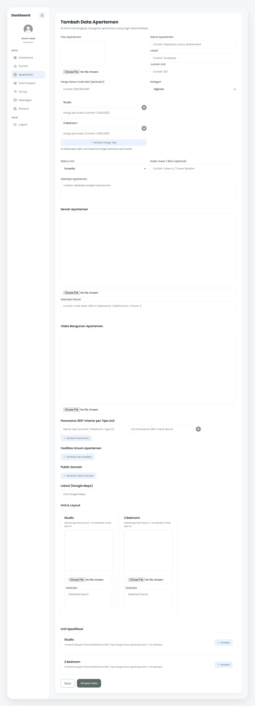

### Admin Dashboard
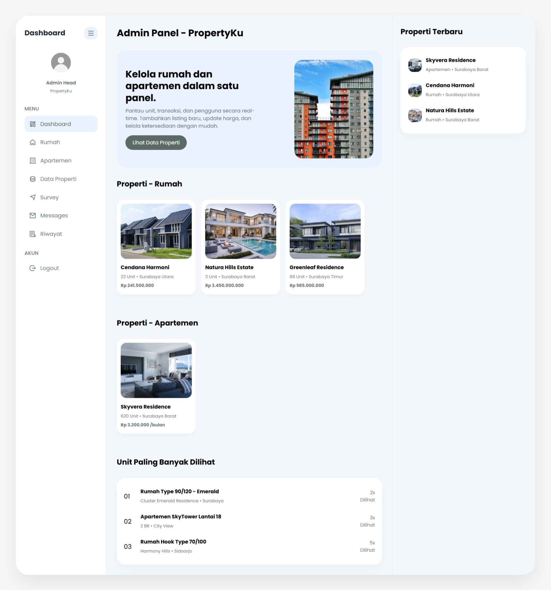

### Admin Data Properti
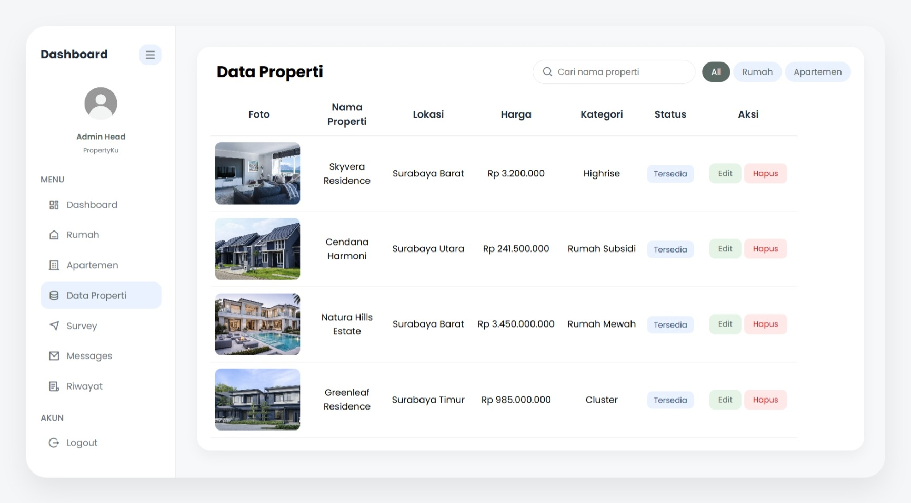

### Admin Message
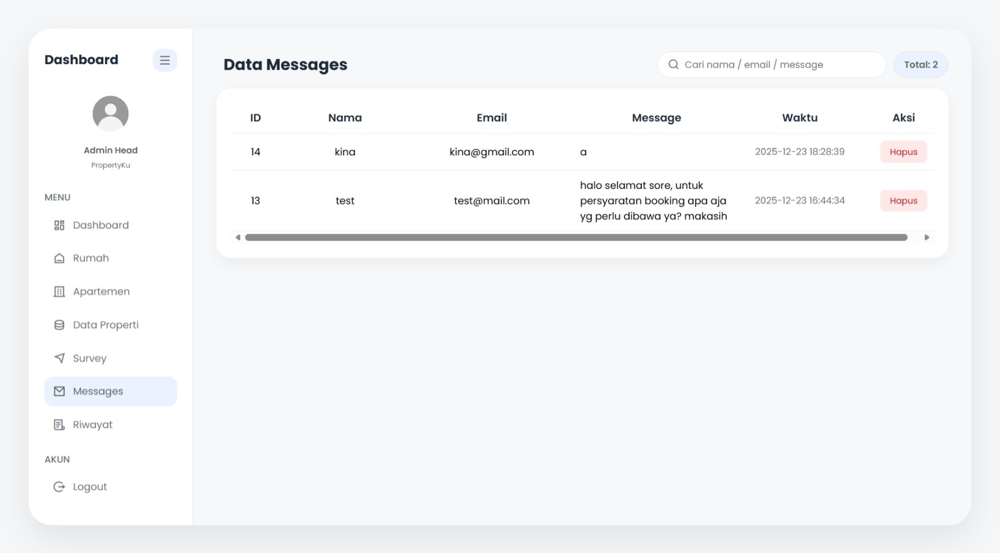

### Admin Riwayat
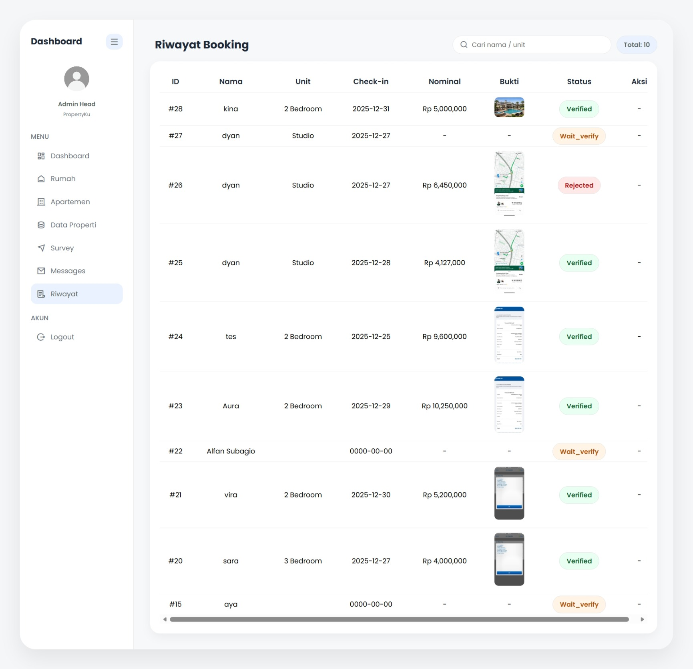

### Admin Rumah
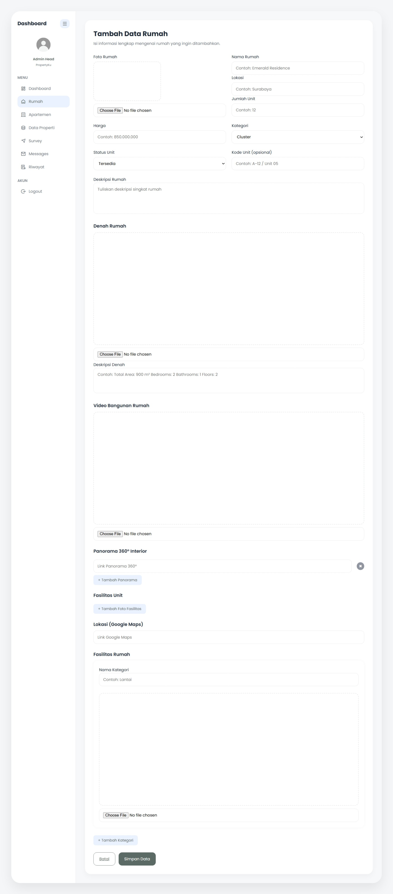

### Admin Survey
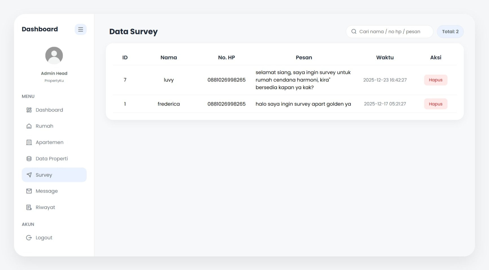

---

## 🧑 User

Berikut adalah tampilan halaman User pada website PropertyKu.

### Login User
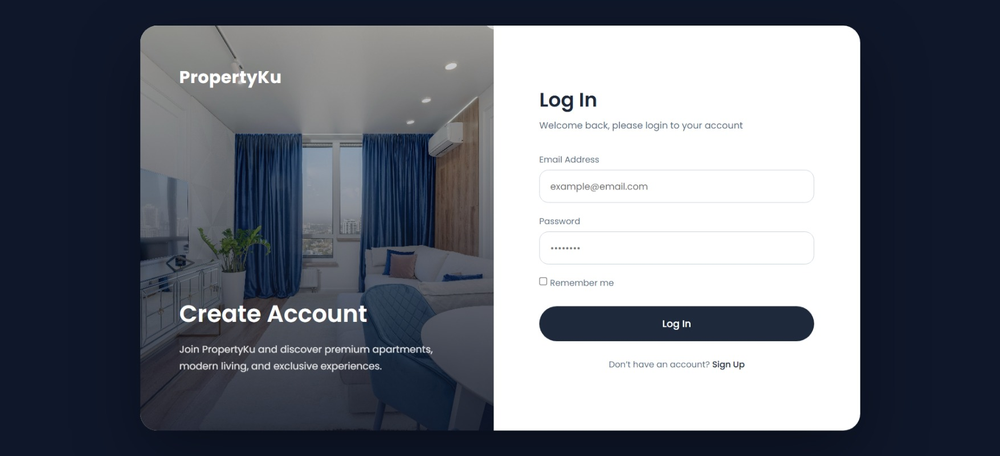

### Sign Up User
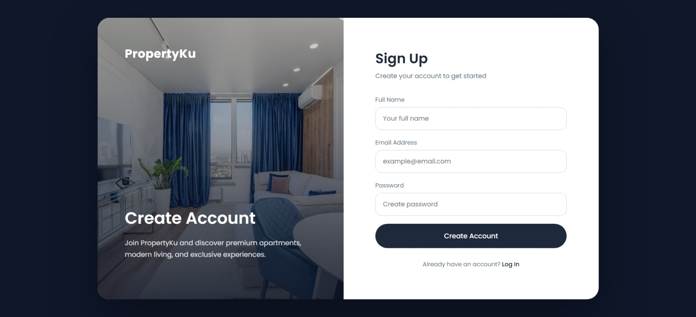

### User Home
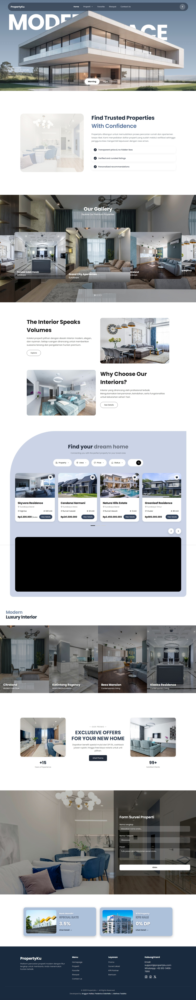

### Detail Properti
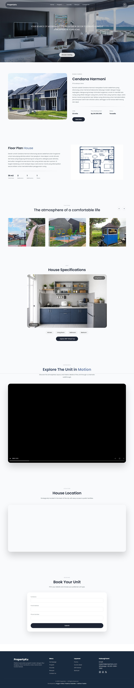

### Favorite Properti
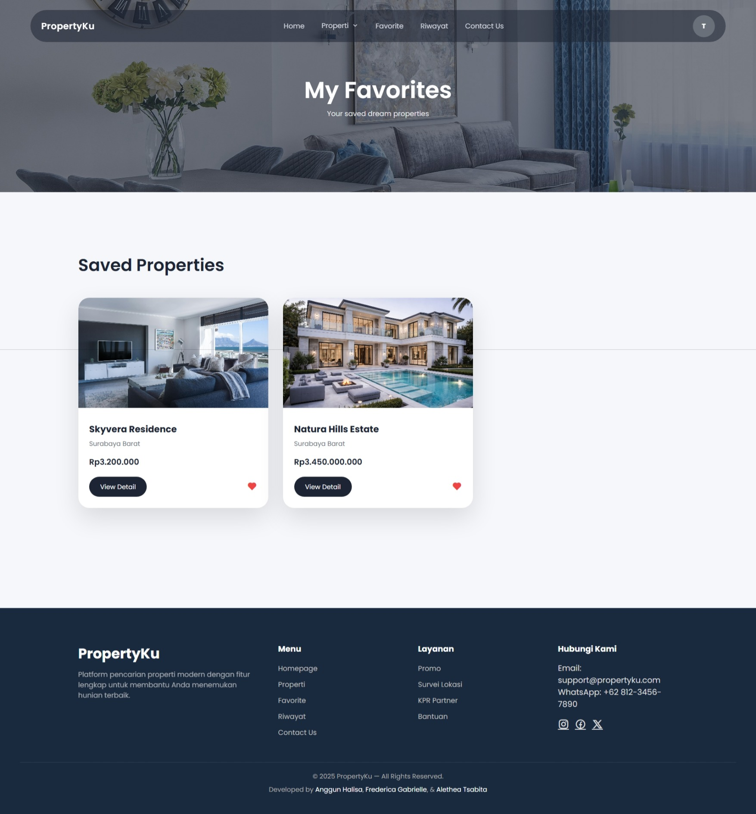

### Booking History
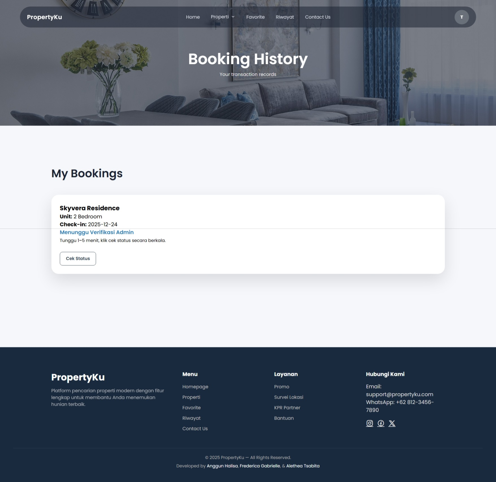

### Contact Us
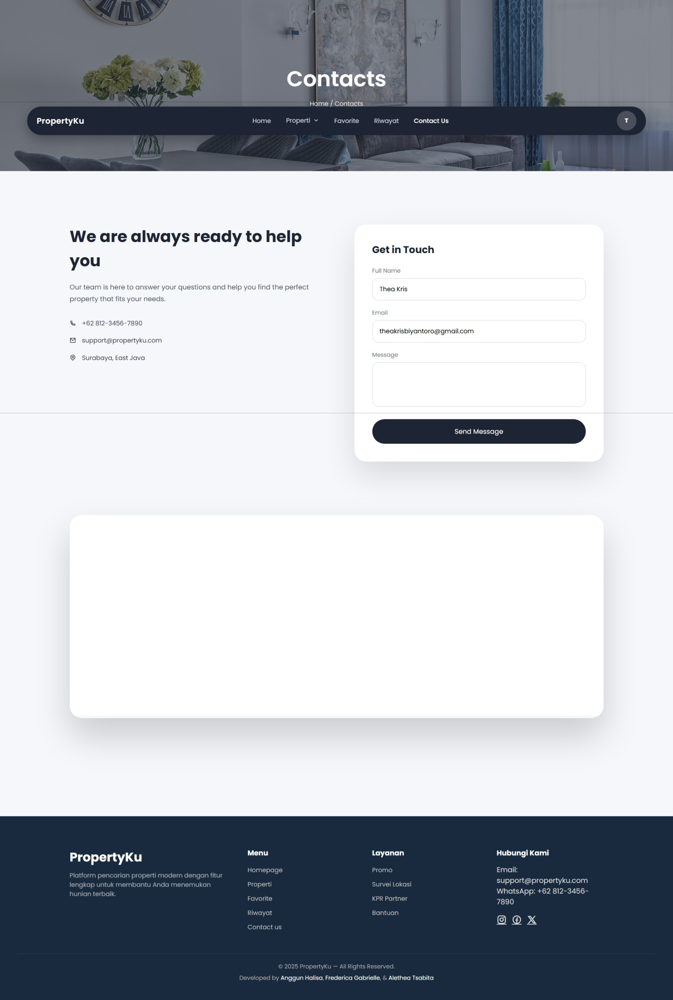

---

👩‍💻 Anggota Kelompok

Project PropertyKu ini dikembangkan oleh:

Anggun Ismi Nurhalisa
NIM: 24051204039

Frederica Gabrielle J. P.
NIM: 24051204049

Alethea Tsabita Calista Syawal
NIM: 24051204057

---

🌐 Link Website

Website dapat diakses melalui tautan berikut:
👉 https://propertiku.unesa.site/
